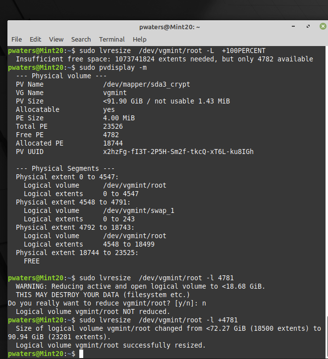
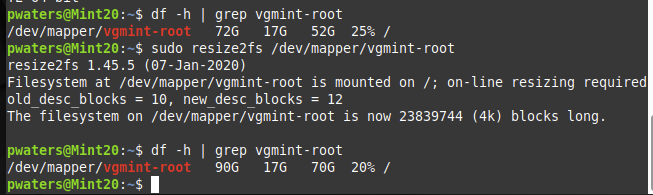

# Resize LUKS Partition in VMWare

I created a disk with a default size, and quickly ran out of space. Here is some documentation on how I resized the disk.

## Virtual Disk Resize

You have to remove all snapshots before resizing the partition

Shut down the machine to resize the volume

Virtual Machine -> Settings -> Hard Disk

## Boot to Recovery ISO

VMWare Settings -> CD/DVD - Use the Mint startup disk
VMWare Settings -> Startup Disk

## Open LUKS disk
sudo cryptsetup open /dev/sda3 sda3_crypt

## Resize Partition

sudo parted 
resizepart
Partition Number? 3
End? 100GB

## Resize Physical Volume
sudo pvdisplay -m

sudo pvresize --setphysicalvolumesize 91.9G /dev/mapper/sda3_crypt 

## Resize Logical Volume
Specify extent, or specify +extent by doing the math on free space yourself. 
 
sudo lvresize -L +70G /dev/vgmint/root 
sudo lvresize -l +4781 /dev/vgmint/root 

DANGER - do not accept destructive options ...  you may have specified incorrectly the extents to be too big or small, which destroys data.

## Resize Filesystem
sudo resize2fs /dev/mapper/vgmint-root

