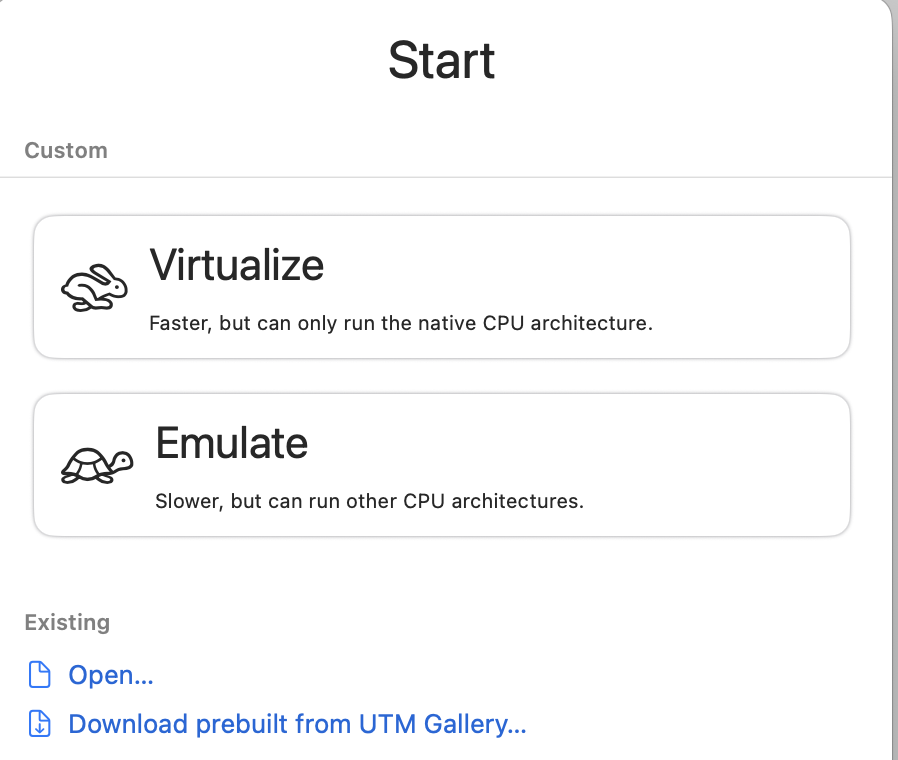
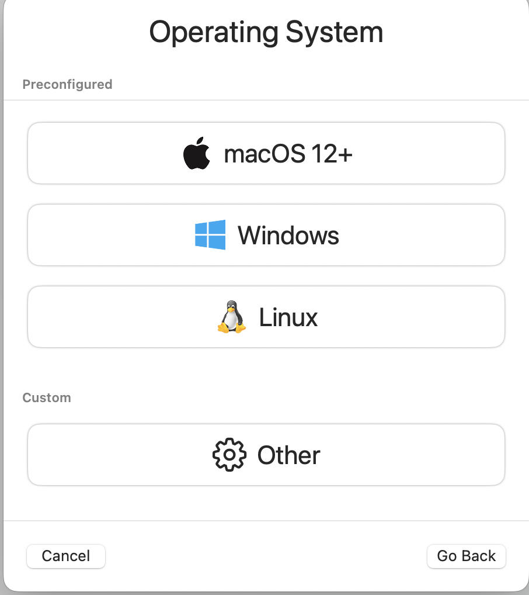
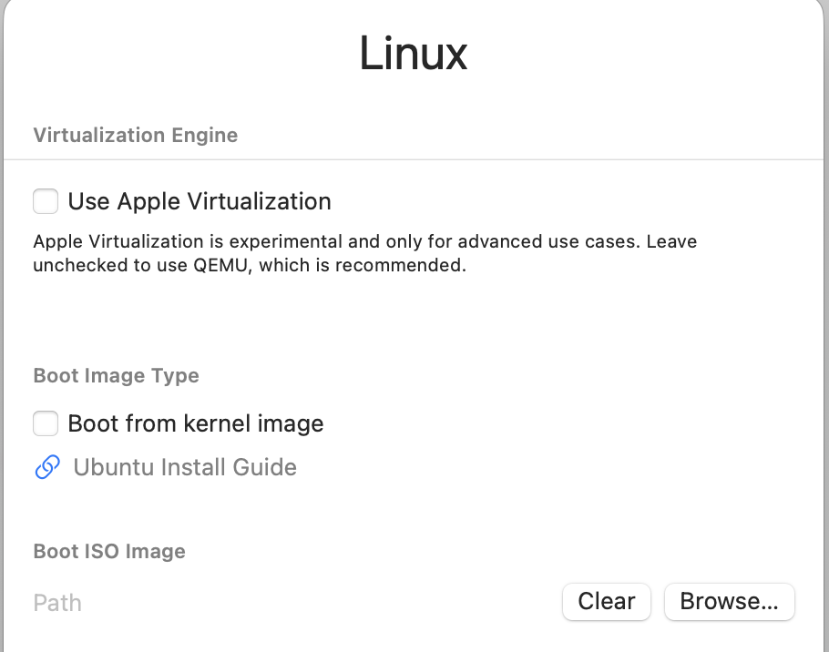
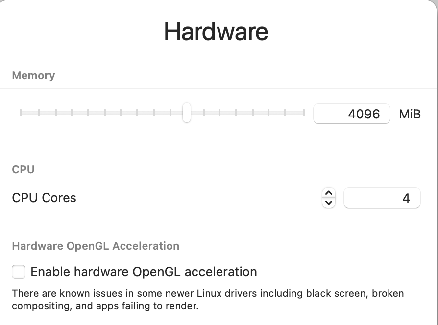
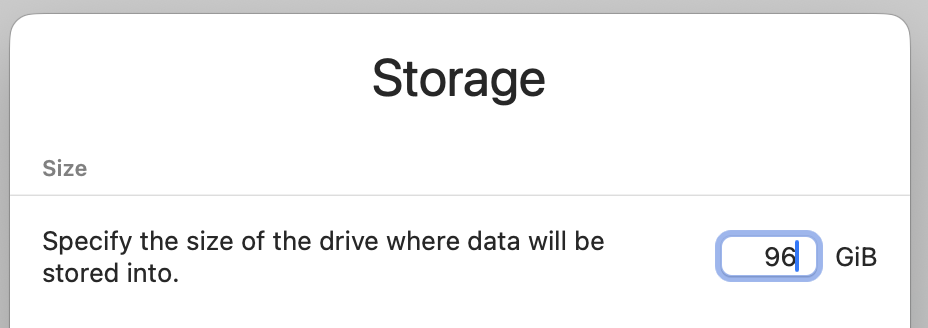
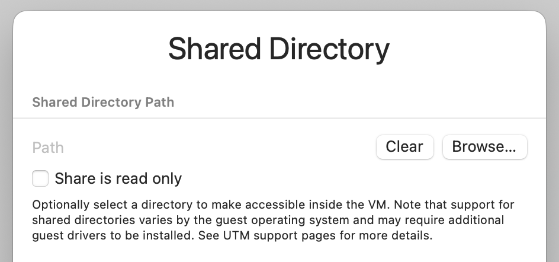
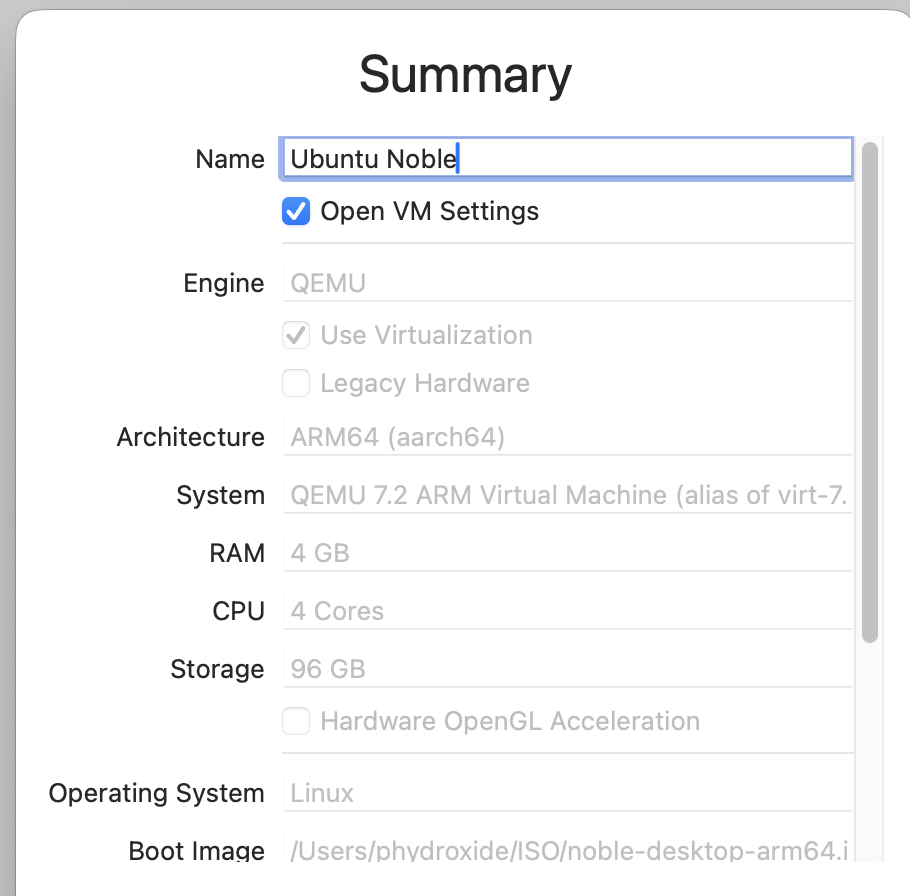

# Ubuntu Linux on Apple M3 UTM

1) Setup UTM
2) Download Ubuntu Linux
3) Create a new VM
- Select Virtualize 

-  Select Linux

-  Browse for Boot ISO

- Provision Hardware (4096 GB / 4 Cores)

- Provision Storage 96 GB

- Skip Shared Directory

- Select "Open VM Settings" on summary

